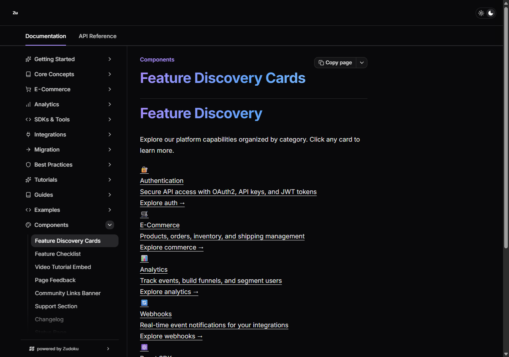
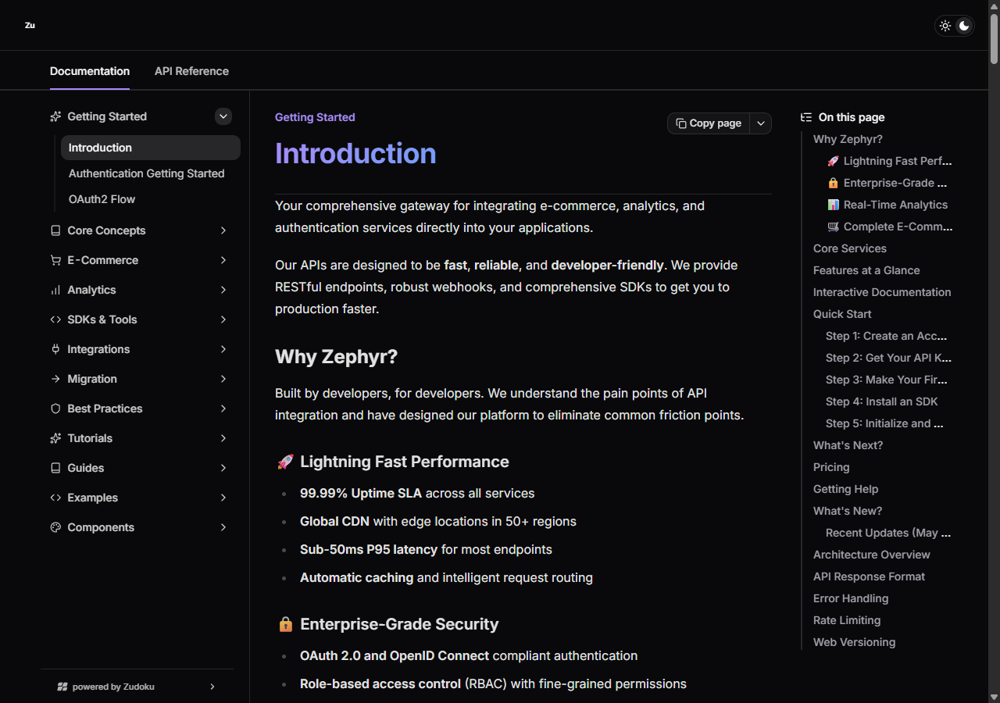
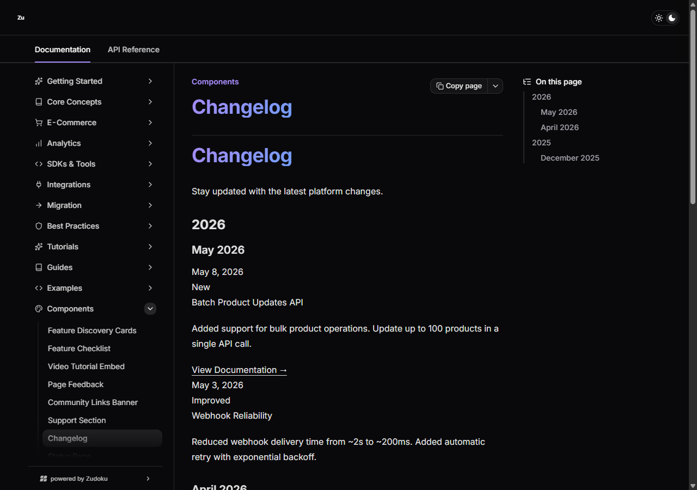
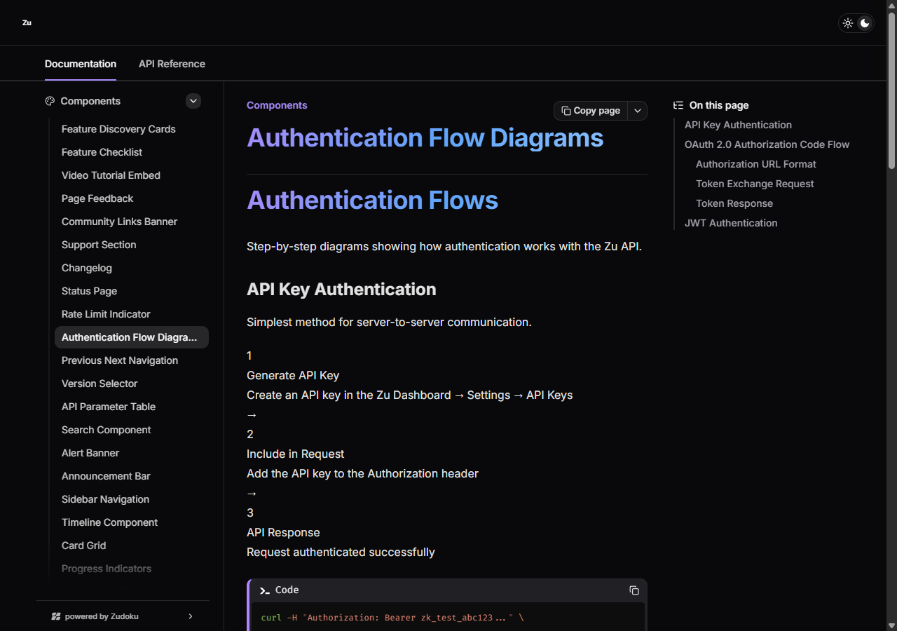
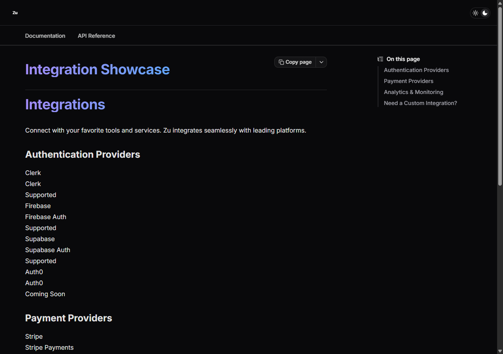

<div align="center">


**Production-ready API documentation that developers actually enjoy using.**

A complete developer portal built with [Zudoku](https://zudoku.dev) — covering E-Commerce, Analytics, and Authentication services with interactive API references, structured guides, and 28 reusable UI component patterns.

[](https://zudoku.dev)
[](https://www.typescriptlang.org/)
[](https://react.dev)
[](LICENSE)

</div>

---

## Why This Exists

Most API documentation is an afterthought — auto-generated, visually sterile, and hard to navigate. The Zephyr Developer Portal takes a different approach: documentation as a **designed experience**, not a byproduct of the build pipeline.

What makes this different from a standard Swagger UI dump:

- **Interactive API explorer** with live request/response examples for every endpoint
- **Domain-organized navigation** that mirrors how developers actually discover APIs — by use case, not by HTTP method
- **Light/dark theming** that respects developer preference and looks intentional in both modes
- **MDX-powered content** that goes beyond specs: tutorials, migration guides, architecture overviews, and best practices all live alongside the reference material
- **28 copy-paste component patterns** for building consistent documentation UI without reinventing the wheel

---

## Live Services

The portal documents three production API domains, each with a complete OpenAPI 3.0 specification:

| Service | Scope | Key Endpoints |
|---------|-------|---------------|
| **E-Commerce** | Products, orders, inventory, shipping | CRUD operations, cart management, shipment tracking |
| **Analytics** | Events, funnels, segments, dashboards | Event ingestion, metric queries, cohort analysis |
| **Authentication** | OAuth 2.0, API keys, SSO providers | Token lifecycle, key rotation, provider management |

Each spec lives in `apis/` as a standalone YAML file and is mapped to a route in the config — no build-time bundling or code generation required.

---

## Quickstart

```bash
# Clone and install
git clone https://github.com/amafjarkasi/zephyr-developer-portal.git
cd zephyr-developer-portal
npm install

# Start the dev server (http://localhost:3000)
npm run dev
```

That's it. The site loads with hot-reload for MDX content. Config changes require a server restart.

### All Commands

| Command | What it does |
|---------|--------------|
| `npm run dev` | Start dev server with MDX hot-reload |
| `npm run build` | Build static site to `dist/` |
| `npm run preview` | Preview the production build locally |
| `npm run lint` | Run ESLint on TypeScript files |

---

## Screenshots

Run `npm run dev` and open http://localhost:3000 to see the full site. Below are screenshots of several component patterns from the gallery:

<table>
<tr>
<td align="center"><b>Feature Cards</b></td>
<td align="center"><b>Component Gallery</b></td>
</tr>
<tr>
<td></td>
<td></td>
</tr>
<tr>
<td align="center"><b>Changelog Timeline</b></td>
<td align="center"><b>Status Dashboard</b></td>
</tr>
<tr>
<td></td>
<td></td>
</tr>
<tr>
<td align="center"><b>Auth Flows</b></td>
<td align="center"><b>Integration Showcase</b></td>
</tr>
<tr>
<td></td>
<td></td>
</tr>
</table>

---

## Architecture

The entire site is driven by a single config file and a content directory. No backend, no database, no server-side rendering.

### How It Works

```
┌──────────────────┐     ┌──────────────────┐     ┌──────────────────┐
│   pages/*.mdx    │     │   apis/*.yaml    │     │ zudoku.config.tsx│
│                  │     │                  │     │                  │
│  Documentation   │     │  OpenAPI 3.0     │     │  Theme           │
│  content pages   │     │  specifications  │     │  Navigation      │
│  (64 pages)      │     │  (3 services)    │     │  API routes      │
│                  │     │                  │     │  Metadata        │
└────────┬─────────┘     └────────┬─────────┘     └────────┬─────────┘
         │                        │                         │
         └────────────────────────┼─────────────────────────┘
                                  v
                        ┌──────────────────┐
                        │   Zudoku Build   │
                        │                  │
                        │  Static HTML     │
                        │  + CSS + JS      │
                        └────────┬─────────┘
                                 v
                        ┌──────────────────┐
                        │     dist/        │
                        │                  │
                        │  Deploy anywhere │
                        └──────────────────┘
```

### Directory Layout

```
zephyr-developer-portal/
├── zudoku.config.tsx          # Single source of truth for the entire site
├── pages/                     # All content (MDX)
│   ├── introduction.mdx       #   Landing page — quickstart, pricing, overview
│   ├── auth/                  #   Authentication: OAuth2, getting started
│   ├── ecommerce/             #   E-Commerce: products, orders, inventory, shipping
│   ├── analytics/             #   Analytics: events, funnels, segments
│   ├── sdks/                  #   SDK guides: React, Python, CLI
│   ├── integrations/          #   Webhooks, payment, third-party connections
│   ├── advanced/              #   Architecture, error handling, rate limiting, webhooks
│   ├── best-practices/        #   Security, performance, reliability
│   ├── tutorials/             #   Step-by-step: first integration, batch processing, webhooks
│   ├── guides/                #   Environments, error handling, rate limits
│   ├── examples/              #   Full-flow: e-commerce, analytics
│   ├── migration/             #   From v1, from Stripe, from Shopify
│   └── components/            #   28 reusable UI component patterns
├── apis/                      # OpenAPI 3.0 specifications
│   ├── ecommerce.yaml         #   Products, orders, cart, inventory
│   ├── analytics.yaml         #   Events, metrics, funnels, segments
│   ├── auth.yaml              #   OAuth2, API keys, SSO
│   └── openapi.yaml           #   Petstore example (placeholder)
├── public/                    # Static assets
│   ├── components.css          #   Component-specific CSS overrides
│   ├── logo-*.svg              #   Branding: light/dark text variants
│   ├── banner*.svg             #   Hero banners
│   ├── favicon.svg             #   Site favicon
│   └── screenshots/            #   Component gallery screenshots
├── package.json
├── tsconfig.json
└── .eslintrc.json
```

### Configuration

Everything is controlled from `zudoku.config.tsx`. The key sections:

| Section | Purpose |
|---------|---------|
| `theme` | Light/dark color palettes, fonts, custom CSS (950+ lines) |
| `site.logo` | Logo source files for light/dark mode |
| `navigation` | Sidebar structure — categories, icons, page links, API links |
| `apis` | Maps OpenAPI YAML files to URL routes |
| `redirects` | URL redirects (e.g., `/` to `/introduction`) |
| `metadata` | Site title and description |
| `syntaxHighlighting` | Languages and Shiki themes (light: `min-light`, dark: `vitesse-dark`) |

---

## Content Authoring

### MDX Pages

Every page requires frontmatter with a `title`. The `description` field is optional.

```yaml
---
title: Managing Products
description: Create, update, and delete products in your catalog
---
```

The frontmatter `title` is rendered by Zudoku in the page header. The custom CSS hides `article h1` elements, so use `##` (H2) and below for visible headings in the body.

### Built-in Components

Zudoku provides several components usable directly in MDX:

**Callout boxes** — for warnings, tips, and important information:

```mdx
<Callout type="info">
  **Info:** This content appears in a styled callout box.
</Callout>
```

Types: `info` | `tip` | `caution` | `warning` | `danger`

**Mermaid diagrams** — for architecture and flow diagrams:

```mdx
<Mermaid chart={`
  flowchart LR
    A[Client] --> B[API Gateway]
    B --> C[Auth Service]
`} />
```

### Static Assets

Reference files from `public/` using absolute paths:

```mdx

```

---

## Component Patterns

The `pages/components/` directory contains **28 documented UI patterns** built with pure CSS and MDX. Each one is a self-contained page you can copy into your own Zudoku project.

### Layout & Display

| Component | Description |
|-----------|-------------|
| `feature-cards` | Clickable card grid with icons, descriptions, and navigation links |
| `card-grid` | Responsive card layout for organizing related content |
| `feature-checklist` | Feature matrix with supported/upcoming/planned status badges |
| `integration-showcase` | Logo grid for displaying supported third-party integrations |
| `sdk-comparison` | Side-by-side SDK matrix with installation commands per language |

### Navigation

| Component | Description |
|-----------|-------------|
| `table-of-contents` | In-page anchor navigation with active section highlighting |
| `breadcrumb` | Hierarchical path display (Home > Category > Page) |
| `prev-next-nav` | Previous/next page navigation with page titles |
| `version-selector` | API version dropdown with `NEW` / `BETA` / `DEPRECATED` tags |
| `sidebar-navigation` | Collapsible sidebar sections with nested items |
| `search-component` | Search input with keyboard shortcut hints (`Ctrl+K`) |

### Content

| Component | Description |
|-----------|-------------|
| `callout-box` | Styled callouts: info, tip, warning, danger variants |
| `alert-banner` | Dismissible banners for site-wide announcements |
| `announcement-bar` | Gradient-background bar for promotions or updates |
| `changelog` | Version timeline with release dates and change categories |
| `timeline` | Chronological event sequence with status indicators |
| `video-tutorials` | Video card grid with play buttons, thumbnails, and duration |
| `image-lightbox` | Expandable image gallery with overlay preview |

### Data & Status

| Component | Description |
|-----------|-------------|
| `api-parameter-table` | Parameter reference: name, type, required, description |
| `rate-limit-indicator` | Visual progress bar showing API quota usage and reset countdown |
| `progress-indicators` | Progress bars, spinners, and skeleton loading states |
| `status-page` | API health dashboard with uptime percentages and incident history |
| `auth-flows` | Step-by-step OAuth2 / JWT authentication flow diagrams |
| `badges-tags` | Inline badges for HTTP methods, status labels, and feature tags |
| `metrics-grid` | Dashboard-style metric cards with large numbers and trends |

### Feedback & Support

| Component | Description |
|-----------|-------------|
| `page-feedback` | "Was this page helpful?" widget with thumbs up/down and optional comment |
| `community-links` | Social links banner (Discord, GitHub, Twitter) |
| `support-section` | Tiered support cards (Community / Pro / Enterprise) |

---

## Design System

### Color Palette

The theme uses a violet-to-blue gradient accent that adapts between light and dark modes:

| Token | Light Mode | Dark Mode |
|-------|-----------|-----------|
| Primary | `#7c3aed` (violet) | `#a78bfa` (lighter violet) |
| Background | `#fafbfc` | `#09090b` |
| Foreground | `#18181b` | `#fafafa` |
| Border | `#e4e4e7` | `#27272a` |
| Muted | `#f4f4f5` | `#27272a` |
| Destructive | `#ef4444` | `#ef4444` |

All tokens are exposed as CSS custom properties (`--primary`, `--background`, etc.) and can be referenced in custom styles.

### Typography

| Role | Font | Usage |
|------|------|-------|
| Sans-serif | Inter | All UI text, headings, body copy |
| Monospace | Fira Code | Code blocks, inline code, API paths |

### Syntax Highlighting

Code blocks use Shiki with boosted saturation (`filter: saturate(1.4)`) and a left border accent in the primary color. Themes: `min-light` for light mode, `vitesse-dark` for dark mode.

The `"http"` language is explicitly registered for HTTP request/response examples.

### HTTP Method Badges

Styled badges for API endpoint methods with distinct colors per verb:

| Method | Light | Dark |
|--------|-------|------|
| `GET` | Green background / dark green text | Dark green background / light green text |
| `POST` | Blue background / dark blue text | Dark blue background / light blue text |
| `PUT` | Yellow background / dark amber text | Dark amber background / light yellow text |
| `PATCH` | Purple background / dark purple text | Dark purple background / light purple text |
| `DELETE` | Red background / dark red text | Dark red background / light red text |

---

## Adding Content

### New documentation page

1. Create `pages/<category>/<name>.mdx` with frontmatter `title`
2. Add the path (e.g., `"/category/name"`) to the `navigation` array in `zudoku.config.tsx`
3. Restart the dev server if you edited the config

### New API specification

1. Add an OpenAPI 3.0 YAML file to `apis/`
2. Map it in the config: `{ type: "file", input: "./apis/<name>.yaml", path: "/api/<name>" }`
3. Add a navigation link: `{ type: "link", label: "<Name> API", to: "/api/<name>" }`

### New component pattern

1. Create `pages/components/<name>.mdx` with frontmatter `title`
2. Add styles to `public/components.css` or `theme.customCss` in the config
3. Add the path to the Components section of the navigation

---

## Deployment

The build produces a fully static site in `dist/`. No server-side rendering, no API routes, no environment variables.

```bash
npm run build    # Output to dist/
npm run preview  # Verify locally before deploying
```

Compatible with any static hosting provider:

| Provider | Method |
|----------|--------|
| Vercel | `vercel --prod` or connect repo |
| Netlify | Drag `dist/` folder or connect repo |
| Cloudflare Pages | Connect GitHub repo |
| GitHub Pages | Push `dist/` to `gh-pages` branch |
| AWS S3 + CloudFront | Upload `dist/` to bucket, configure CloudFront |
| Any web server | Serve `dist/` as static files |

---

## Tech Stack

| Technology | Version | Role |
|-----------|---------|------|
| [Zudoku](https://zudoku.dev) | 0.77.0 | Static site generator for API documentation |
| [React](https://react.dev) | 19 | UI runtime (used internally by Zudoku) |
| [TypeScript](https://typescriptlang.org) | 6 | Config file type safety |
| [Mermaid](https://mermaid.js.org) | 11 | Diagram rendering in MDX content |
| [Shiki](https://shiki.style) | bundled | Syntax highlighting with custom themes |
| [Vite](https://vite.dev) | bundled | Build tooling (via Zudoku) |

---

## Resources

- [Zudoku Documentation](https://zudoku.dev/docs) — Framework guides, configuration reference, component API
- [OpenAPI 3.0 Specification](https://swagger.io/specification/) — Standard for REST API descriptions
- [MDX Documentation](https://mdxjs.com/) — Markdown with JSX component support
- [Mermaid Documentation](https://mermaid.js.org/) — Diagram and flowchart syntax reference
- [Lucide Icons](https://lucide.dev/) — Icon names used in navigation configuration

---

## License

MIT
